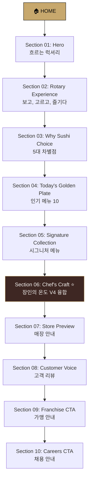

# SUSHI CHOICE 프리미엄 홈페이지 기획서
## V3(움직이는 예술) × V4(온도의 과학) 하이브리드 컨셉

---

## 1. 컨셉 정의

### 브랜드 슬로건
> **"움직이는 예술, 장인의 온도"**

### 컨셉 공식
```
메인 컨셉 (V3) — 움직이는 예술 (Modern Luxury Rotary)
    → 페이지 전체 레이아웃, 인터랙션, 비주얼 시스템을 지배
    → 황금빛 레일이 흐르는 모던 럭셔리 회전초밥의 시각 언어

서브 컨셉 (V4) — 온도의 과학 (Chef's Craftsmanship)
    → Brand, Philosophy, Chef 섹션의 콘텐츠 깊이를 담당
    → 장인의 손, 36.5°C 샤리, 칼집의 과학으로 신뢰를 구축
```

### 디자인 원칙
| 원칙 | 적용 |
|:---|:---|
| **Apple 90%** | 대형 타이포그래피, 여백 중심, 스토리텔링 스크롤, 미니멀 UI |
| **Ferrari 10%** | 다크 럭셔리, 골드 액센트, 강렬한 비주얼 임팩트 |
| **V3 레일 DNA** | 수평 흐름 모티프, 황금빛 라인 디바이더, 패럴랙스 스크롤 |
| **V4 장인 DNA** | 클로즈업 매크로 이미지, 손 & 칼 텍스처, 따뜻한 우드 톤 |

### 컬러 시스템
| 역할 | 컬러 | 용도 |
|:---|:---|:---|
| **Primary** | `#0B0B0B` (Obsidian Black) | 배경, 주 텍스트 |
| **Secondary** | `#F8F7F4` (Ivory White) | 보조 텍스트, 밝은 섹션 배경 |
| **Accent** | `#D4001A` (Ferrari Red) | CTA 호버, 긴급 알림 (사용 비중 10% 이하) |
| **Premium** | `#C7A86D` (Gold) | 레일 라인, 섹션 디바이더, 헤딩 액센트 |
| **Wood** | `#3E2723` (Dark Walnut) | 텍스처 배경, 셰프 섹션 오버레이 |
| **Warm** | `#1A1410` (Dark Teak) | Philosophy/Brand 섹션 배경 |

---

## 2. 홈페이지 전체 섹션 구성 (HOME)

총 **10개 섹션**으로 구성하며, 각 섹션은 풀스크린(100vh) 또는 대형 여백 기반으로 설계합니다.

---

### Section 01 — HERO: 흐르는 럭셔리

| 항목 | 내용 |
|:---|:---|
| **레이아웃** | 풀스크린(100vh), 영상 배경 또는 시네마틱 이미지 슬라이드 |
| **비주얼** | 정교한 황금빛 레일 위를 보석처럼 빛나는 스시들이 흘러가는 슬로우모션 루프 영상 |
| **컬러** | `#0B0B0B` 배경, `#C7A86D` 골드 라인 오버레이 |

**카피라이팅**:
```
메인 헤드라인 (대형, 화면 중앙)
────────────────────────────────────
SUSHI CHOICE
움직이는 예술, 회전초밥의 새로운 기준

서브 헤드라인 (골드 컬러, 작은 사이즈)
────────────────────────────────────
Premium Rotary Sushi Experience
```

**CTA 버튼 (3개, 가로 배열)**:
| 버튼 | 스타일 | 링크 |
|:---|:---|:---|
| 매장 찾기 | Primary (골드 배경 + 블랙 텍스트) | `/store` |
| 메뉴 보기 | Secondary (골드 보더 + 화이트 텍스트) | `/menu` |
| 가맹 문의 | Ghost (밑줄 + 화이트 텍스트) | `/franchise` |

**인터랙션**:
- 스크롤 다운 시 영상 위에 골드 라인이 수평으로 길어지며 다음 섹션으로 전환 유도
- 마우스 위치에 따라 골드 파티클이 미세하게 움직이는 앰비언트 효과

---

### Section 02 — ROTARY EXPERIENCE: 보고, 고르고, 즐기다

| 항목 | 내용 |
|:---|:---|
| **레이아웃** | 가로 스크롤 패럴랙스 (또는 세로 스크롤 트리거 가로 전환) |
| **비주얼** | 레일 위의 스시가 왼쪽에서 오른쪽으로 천천히 흘러가는 수평 시퀀스 |
| **컬러** | `#0B0B0B` 배경, `#C7A86D` 레일 라인이 화면 중앙을 관통 |

**카피라이팅 (스크롤 단계별 순차 등장)**:
```
Step 1 — 보다 (SEE)
    "레일 위를 흐르는 신선함,
     눈으로 먼저 즐기세요."
    → 비주얼: 다양한 초밥이 레일 위를 지나가는 와이드 숏

Step 2 — 고르다 (CHOOSE)
    "마음이 이끄는 대로,
     당신만의 한 접시를 선택하세요."
    → 비주얼: 손이 접시를 집어 드는 클로즈업

Step 3 — 주문하다 (ORDER)
    "레일 너머 셰프에게 직접,
     원하는 그 맛을 주문하세요."
    → 비주얼: 태블릿 터치 → 셰프가 칼을 드는 장면 전환

Step 4 — 즐기다 (ENJOY)
    "입 안에서 완성되는
     프리미엄 로터리 스시 경험."
    → 비주얼: 가족이 함께 웃으며 식사하는 따뜻한 장면
```

**인터랙션**:
- 스크롤 진행률에 따라 골드 레일 라인이 화면 좌 → 우로 이동
- 각 단계별 이미지가 페이드 인 + 스케일업으로 등장
- 레일 라인 위에 작은 골드 원형 인디케이터가 현재 단계를 표시

---

### Section 03 — WHY SUSHI CHOICE: 5대 차별점

| 항목 | 내용 |
|:---|:---|
| **레이아웃** | 5개 카드, 데스크톱 가로 1열 / 모바일 세로 스크롤 |
| **비주얼** | 각 카드에 아이콘형 일러스트 또는 심볼 + 대형 숫자 |
| **컬러** | `#1A1410` 다크 배경 위 `#F8F7F4` 텍스트, `#C7A86D` 아이콘 |

**5대 차별점 카피**:

| # | 영문 키워드 | 한국어 헤드라인 | 서브 카피 |
|:---|:---|:---|:---|
| 01 | **Freshness** | 매일의 신선함 | "새벽 산지에서 출발한 재료가 오전 매장에 도착합니다." |
| 02 | **Variety** | 80가지 이상의 선택 | "연어부터 와규까지, 선택의 즐거움이 레일 위를 흐릅니다." |
| 03 | **Value** | 합리적인 프리미엄 | "최상급 재료를 가장 합리적인 가격으로 즐기세요." |
| 04 | **Experience** | 회전초밥의 즐거움 | "보고, 고르고, 즐기는 오직 이곳에서만 가능한 미식 경험." |
| 05 | **Family** | 가족이 함께하는 식탁 | "어린아이부터 부모님까지, 모두가 편안한 프리미엄 다이닝." |

**인터랙션**:
- 스크롤 진입 시 각 카드가 0.15초 간격으로 하단에서 페이드업
- 호버 시 카드 상단의 골드 라인이 좌→우로 슬라이드

---

### Section 04 — TODAY'S GOLDEN PLATE: 오늘의 인기 메뉴

| 항목 | 내용 |
|:---|:---|
| **레이아웃** | 수평 캐러셀 or 그리드 (Top 10) |
| **비주얼** | 각 메뉴의 대형 원형 이미지 + 순위 번호(골드 세리프 숫자) |
| **컬러** | `#0B0B0B` 배경, 순위 번호 `#C7A86D`, 메뉴명 `#F8F7F4` |

**카피라이팅**:
```
섹션 타이틀
────────────────────────────
TODAY'S GOLDEN PLATE
실시간 미식가들이 선택한 오늘의 10선

서브 카피
────────────────────────────
"지금 이 순간, 가장 많은 사랑을 받는 메뉴입니다."
```

**인기 메뉴 예시 데이터**:
| 순위 | 메뉴명 | 카테고리 |
|:---|:---|:---|
| 01 | 연어 뱃살 초밥 | Salmon |
| 02 | 광어 엔가와 초밥 | Flatfish |
| 03 | 새우 초밥 | Shrimp |
| 04 | 참치 대뱃살 초밥 | Tuna |
| 05 | 육회 초밥 | Wagyu |
| 06 | 장어 초밥 | Eel |
| 07 | 연어 아부리 초밥 | Salmon |
| 08 | 갈치 초밥 | Seasonal |
| 09 | 새우튀김 롤 | Roll |
| 10 | 성게알 군함 | Uni |

**인터랙션**:
- 자동 슬라이드 (5초 간격) + 드래그 스크롤
- 호버 시 해당 메뉴 이미지 확대(1.05x) + 골드 보더 활성화

---

### Section 05 — SIGNATURE COLLECTION: 시그니처 메뉴

| 항목 | 내용 |
|:---|:---|
| **레이아웃** | Apple 제품 소개 스타일 — 풀스크린 대형 이미지 + 미니멀 텍스트 |
| **비주얼** | 한 컬렉션당 풀 블리드(full-bleed) 이미지, 음식 자체가 주인공 |
| **컬러** | 이미지 위에 `#0B0B0B` 반투명 그라디언트 오버레이 |

**5대 시그니처 컬렉션**:

````carousel
### 🥇 Premium Salmon Collection
**골든 레일 시그니처**
> "대서양의 풍미를 한 점에 담다"

연어 뱃살, 연어 아부리(토치), 훈제 연어,
트러플 오일 연어 타타키

*비주얼: 토치 불꽃이 연어 위를 스치는 순간의 매크로 숏*
<!-- slide -->
### 🥈 Premium Tuna Collection
**딥 오션 셀렉션**
> "참다랑어의 진가, 적신에서 대뱃살까지"

참치 적신, 참치 중뱃살, 참치 대뱃살,
참치 다다끼

*비주얼: 루비색 참치 단면이 빛에 반사되는 순간*
<!-- slide -->
### 🥉 Premium Shrimp Collection
**크리스탈 셀렉션**
> "투명한 바다의 선물, 살아있는 식감"

보탄새우, 단새우, 새우 아부리,
새우튀김 초밥

*비주얼: 반투명한 생새우 살이 빛을 투과하는 순간*
<!-- slide -->
### 🏅 Wagyu & Special Collection
**블랙 플레이트 프레스티지**
> "레일 위에서 만나는 최고급 클래스"

A5 와규 타타키, 육회 초밥, 전복 버터구이,
성게알 감태 말이

*비주얼: 와규 마블링 위에 골드 리프가 올려진 초밥*
<!-- slide -->
### 🌸 Seasonal Collection
**계절의 찰나**
> "지금 이 계절만 허락한 한정의 맛"

제철 자연산 어종 5~7종으로 구성
(봄: 도미, 여름: 전어, 가을: 꽁치, 겨울: 방어)

*비주얼: 벚꽃잎/단풍잎이 초밥 옆에 놓인 계절 감성 숏*
````

**인터랙션**:
- 스크롤 기반 풀페이지 전환 (한 컬렉션 = 한 화면)
- 이미지는 스크롤 시 미세한 패럴랙스로 깊이감 부여
- 컬렉션 전환 시 골드 라인이 화면 중앙에서 좌우로 펼쳐지는 트랜지션

---

### Section 06 — CHEF'S CRAFT: 장인의 온도 ⭐ (V4 융합 핵심)

> [!IMPORTANT]
> 이 섹션이 V4(온도의 과학) 컨셉이 가장 깊이 있게 녹아드는 핵심 영역입니다.

| 항목 | 내용 |
|:---|:---|
| **레이아웃** | 스플릿 스크린 (좌: 대형 셰프 손 이미지 / 우: 텍스트 스토리) |
| **비주얼** | 다크 월넛(Dark Walnut) 톤 배경, 셰프의 손과 칼날 매크로 클로즈업 |
| **컬러** | `#1A1410` + `#3E2723` 우드 텍스처 배경, `#C7A86D` 포인트 |

**카피라이팅 (3단 스크롤 스토리)**:
```
─── Part 1: 샤리의 온도 ───

"36.5°C"
손끝의 온도가 완성하는 샤리의 기적

셰프의 체온이 밥알에 전해지는 그 찰나,
200알의 쌀이 완벽한 공기층을 품습니다.
기계가 절대 흉내 낼 수 없는 영역,
그것이 스시초이스 장인의 업(業)입니다.


─── Part 2: 칼의 각도 ───

"一刀一點"
생선의 결을 읽는 칼날의 과학

숙련된 손끝이 생선의 섬유질을 읽고,
정확한 각도의 칼집으로 극상의 식감을 만듭니다.
한 번의 칼질에 담긴 15년의 수련.


─── Part 3: 쌀의 집착 ───

"단 한 가마의 타협도 없이"
최고급 신동진 쌀, 천연 발효 식초, 3년 숙성 천일염

화학 감미료를 배제한 순수한 재료만으로
매일 아침 전통 가마솥 방식으로 밥을 짓습니다.
```

**인터랙션**:
- 스크롤 진행에 따라 좌측 이미지가 전환 (손 → 칼 → 쌀)
- 각 파트 전환 시 이미지에 미세한 줌인 효과
- "36.5°C" 숫자가 카운트업 애니메이션으로 등장
- 다크 우드 텍스처 배경이 부드럽게 그라디언트 전환

---

### Section 07 — STORE PREVIEW: 매장 안내

| 항목 | 내용 |
|:---|:---|
| **레이아웃** | 4개 매장 카드, 2×2 그리드 (데스크톱) / 가로 캐러셀 (모바일) |
| **비주얼** | 각 매장의 외관 또는 인테리어 대표 이미지 |
| **컬러** | `#0B0B0B` 배경, 카드 `#151515` + `#C7A86D` 보더 라인 |

**카피라이팅**:
```
섹션 타이틀
────────────────────────────
OUR STORES
가까운 스시초이스에서 만나세요

서브 카피
────────────────────────────
"프리미엄 회전초밥의 경험이 기다리는 곳"
```

**매장 카드 구성**:
| 매장 | 주요 정보 | CTA |
|:---|:---|:---|
| 송내본점 | 주소, 영업시간, 주차 가능 | 길찾기 → 네이버 지도 |
| 은계점 | 주소, 영업시간, 주차 가능 | 길찾기 → 네이버 지도 |
| 송도점 | 주소, 영업시간, 주차 가능 | 길찾기 → 네이버 지도 |
| 인천서구점 | 주소, 영업시간, 주차 가능 | 길찾기 → 네이버 지도 |

**인터랙션**:
- 호버 시 카드 이미지 위에 골드 오버레이 + 상세 정보 슬라이드 업
- 길찾기 버튼 클릭 시 해당 네이버 지도 링크로 새 탭 오픈

---

### Section 08 — CUSTOMER VOICE: 고객 리뷰

| 항목 | 내용 |
|:---|:---|
| **레이아웃** | 자동 슬라이드 캐러셀 (3~4개 동시 노출) |
| **비주얼** | 실제 리뷰 스크린샷 or 카드화된 텍스트 리뷰 |
| **컬러** | `#F8F7F4` 밝은 배경 (대비를 위한 섹션 전환), `#0B0B0B` 텍스트 |

**카피라이팅**:
```
섹션 타이틀
────────────────────────────
REAL VOICES
고객님의 진심이 담긴 이야기

서브 카피
────────────────────────────
"네이버, 블로그, 인스타그램에서 확인하세요."
```

**리뷰 출처 탭**:
- 네이버 리뷰 | 블로그 후기 | 인스타그램 | 영상 후기

**인터랙션**:
- 무한 자동 슬라이드 (3초 간격)
- 호버 시 일시정지
- 리뷰 카드 클릭 시 원본 출처로 새 탭 이동

---

### Section 09 — FRANCHISE CTA: 가맹 안내

| 항목 | 내용 |
|:---|:---|
| **레이아웃** | 풀스크린, 시네마틱 배경 이미지 위 중앙 정렬 텍스트 |
| **비주얼** | 성공적으로 운영 중인 매장 내부의 활기찬 모습 (블러 처리된 배경) |
| **컬러** | `#0B0B0B` 오버레이 + `#C7A86D` CTA 버튼 |

**카피라이팅**:
```
메인 헤드라인
────────────────────────────
성공하는 회전초밥 브랜드,
함께 성장할 파트너를 찾습니다.

서브 카피
────────────────────────────
검증된 운영 시스템과 식자재 공급망,
그리고 본사의 전폭적인 지원으로
안정적인 수익 구조를 만듭니다.
```

**CTA**: `가맹 상담 신청 →` (골드 배경 대형 버튼, `/franchise` 링크)

---

### Section 10 — CAREERS CTA: 채용 안내

| 항목 | 내용 |
|:---|:---|
| **레이아웃** | 풀스크린 또는 하프스크린, 인물 중심 이미지 |
| **비주얼** | 밝은 미소로 손님을 맞이하는 직원 또는 진지하게 초밥을 쥐는 젊은 셰프 |
| **컬러** | `#1A1410` 우드 톤 배경, `#F8F7F4` 텍스트 |

**카피라이팅**:
```
메인 헤드라인
────────────────────────────
좋은 회전초밥은
좋은 사람으로부터 시작됩니다.

서브 카피
────────────────────────────
당신의 열정이
스시초이스의 다음 이야기를 만듭니다.
```

**CTA**: `채용공고 보기 →` (골드 보더 버튼, `/careers` 링크)

---

## 3. 서브 페이지: BRAND 페이지 (V4 심화)

> [!IMPORTANT]
> Brand 페이지는 V4(온도의 과학) 컨셉이 가장 집중적으로 전개되는 독립 페이지입니다.

### 섹션 구성

#### Brand Hero
```
SUSHI CHOICE

내 가족이 먹는다는 마음으로,
신선함과 정성을 매일 담습니다.
```
- 비주얼: 셰프가 정성스럽게 초밥을 쥐는 시네마틱 풀스크린

---

#### Vision & Mission

```
─── VISION ───
대한민국 대표 프리미엄 회전초밥 브랜드

─── MISSION ───
좋은 재료 · 좋은 가격 · 좋은 경험
세 가지 원칙을 어떤 상황에서도 타협하지 않습니다.
```

---

#### Brand Philosophy: 장인의 3대 원칙 (V4 핵심)

```
원칙 01 — 신선한 재료
━━━━━━━━━━━━━━━━
"신선함은 타협하지 않습니다."

새벽 03:00, 산지의 어선이 출항하기 전부터
스시초이스의 하루는 시작됩니다.
완도산 광어, 제주산 참다랑어, 동해산 단새우…
전국 최고의 포구에서 엄선한 재료만이
우리의 레일 위에 오를 수 있습니다.


원칙 02 — 가족을 위한 한 접시
━━━━━━━━━━━━━━━━
"매일, 가족처럼 준비합니다."

부모님과 아이들이 건강하고 맛있게 즐길 수 있도록
인공 조미료(MSG)와 방부제를 일절 배제합니다.
천연 효모 발효 식초로 만든 샤리,
3년간 간수를 뺀 국내산 천일염,
단일 품종 최고급 신동진 쌀.
작은 것 하나도 대충 고르지 않습니다.


원칙 03 — 정직한 맛
━━━━━━━━━━━━━━━━
"손끝의 온도로 증명합니다."

경력 15년 이상의 베테랑 일식 장인이
매일 아침 전통 가마솥 방식으로 샤리를 안치고,
36.5°C의 체온으로 밥알 사이 완벽한 공기층을 빚습니다.
기계가 흉내 낼 수 없는, 오직 장인만의 영역입니다.
```

---

#### Brand Story: 설립 배경
```
스시초이스는 하나의 질문에서 시작되었습니다.

"회전초밥은 왜 가볍고 대중적이기만 해야 할까?"

우리는 회전 레일을 단순한 서빙 도구가 아닌,
셰프와 고객이 시각적으로 교감하는
'미식의 무대'로 재정의했습니다.

오마카세의 품격은 유지하되,
회전초밥만의 자유로움과 즐거움을 더하여
누구나 프리미엄 스시를 부담 없이 즐기는
새로운 외식 문화를 만들어가고 있습니다.

은은한 황금빛 레일 위를 흐르는 한 접시 한 접시는
장인의 철학이 담긴 개별 작품이며,
당신의 소중한 식탁을 위한 정성스러운 초대장입니다.
```

---

## 4. 고객 신뢰 문구 (Trust Copy) — 전 페이지 공통 활용

아래 문구들은 홈페이지 곳곳에 자연스럽게 배치하여 브랜드 신뢰를 강화합니다.

### 원재료 신뢰
| # | 신뢰 문구 |
|:---|:---|
| T1 | "새벽 03:00 산지 출발 → 오전 10:00 매장 도착. 당일 배송, 당일 소진 원칙." |
| T2 | "1등급 완도산 광어, 제주산 생참치만을 고집하며 원산지 100% 추적 관리." |
| T3 | "인공 조미료(MSG)·방부제 무첨가. 천연 효모 발효 식초와 3년 숙성 천일염만 사용." |

### 위생·안전 신뢰
| # | 신뢰 문구 |
|:---|:---|
| T4 | "HACCP 인증 콜드체인 물류 시스템, 이동 중 온도 2°C 이하 엄격 유지." |
| T5 | "매장 내 방사능 측정기 매일 3회 검사, 실시간 측정값 투명 공개." |
| T6 | "식품 등급 SUS316L 스테인리스 레일, 매 시간 소독 및 위생 점검." |

### 장인 신뢰
| # | 신뢰 문구 |
|:---|:---|
| T7 | "경력 15년 이상 베테랑 일식 장인이 주방을 책임집니다." |
| T8 | "전통 가마솥 방식으로 매일 아침 샤리를 안칩니다." |
| T9 | "단일 품종 최고급 신동진 쌀, 도정 후 1시간 이내 당일 취사." |

---

## 5. 인터랙션 & 모션 디자인 시스템

### 글로벌 모션 원칙
| 요소 | 설정 |
|:---|:---|
| **기본 트랜지션** | `ease-out`, `0.4s ~ 0.6s` |
| **스크롤 애니메이션** | Intersection Observer 기반, 뷰포트 진입 시 트리거 |
| **패럴랙스 깊이** | 배경 `0.3x`, 전경 `1.0x`, 텍스트 `1.1x` |
| **호버 효과** | 스케일 `1.02 ~ 1.05`, 골드 보더 fade-in |
| **페이지 전환** | 골드 라인이 화면 중앙에서 좌우로 펼쳐지는 커튼 이펙트 |

### V3 레일 모티프 통합 규칙
```
┌─────────────────────────────────────────────────────┐
│  골드 레일 라인의 활용 규칙                              │
│                                                       │
│  1. 섹션 간 디바이더: 가로 골드 라인 (1px, #C7A86D)       │
│  2. 스크롤 진행 표시기: 화면 우측 세로 골드 프로그레스 바     │
│  3. 텍스트 강조: 키워드 아래 골드 언더라인                  │
│  4. CTA 호버: 버튼 하단에 골드 라인 슬라이드 인            │
│  5. 이미지 프레임: 좌상단/우하단 골드 코너 장식             │
│                                                       │
│  ⚠ 과도한 사용 금지 — 레일 라인은 '흐름'을 암시하되         │
│    전체 면적의 5% 이내로 절제하여 사용                     │
└─────────────────────────────────────────────────────┘
```

---

## 6. 반응형 브레이크포인트

| 디바이스 | 너비 | 레이아웃 변화 |
|:---|:---|:---|
| **Desktop** | 1280px+ | 풀 레이아웃, 패럴랙스 전체 활성 |
| **Tablet** | 768px ~ 1279px | 2열 → 1열 전환, 패럴랙스 축소 |
| **Mobile** | ~767px | 세로 스크롤 단일 열, 터치 스와이프 인터랙션 |

---

## 7. 전체 페이지 흐름 다이어그램



---

## User Review Required

> [!IMPORTANT]
> **승인 후 실행 단계로 진행합니다.** 아래 사항에 대한 피드백을 부탁드립니다.

### 확인이 필요한 사항

1. **섹션 순서**: Section 06(Chef's Craft)의 위치가 시그니처 메뉴(05) 다음에 오는 것이 자연스러운지, 아니면 Why Sushi Choice(03) 직후로 앞당기는 것이 좋을지?

2. **Rotary Experience 인터랙션(Section 02)**: 가로 스크롤 패럴랙스(데스크톱에서 마우스 휠 → 가로 이동) vs 세로 스크롤 트리거(일반 스크롤하면 이미지가 가로로 전환) 중 어떤 방식을 선호하시나요?

3. **고객 리뷰 섹션(Section 08)**: 실제 네이버/블로그/인스타 리뷰를 임베드하실 건지, 카드 형태로 재구성(리뷰 텍스트 + 출처 링크)하실 건지?

4. **Brand 페이지의 깊이**: 현재 Brand 페이지에 V4 장인 철학 3대 원칙을 상세히 서술했는데, 더 깊이 들어가야 할 영역(예: 셰프 개인 프로필, 재료 산지 상세 지도 등)이 있을까요?

5. **메뉴명**: 제안된 메뉴명(골든 레일 시그니처, 블랙 플레이트 프레스티지 등)이 실제 매장에서 사용 중인 메뉴명과 다를 수 있습니다. 실제 메뉴 데이터를 별도로 공유해 주실 수 있나요?

---

## Verification Plan

### Automated Tests
- `npm run dev` 정상 실행 확인
- Lighthouse 4개 항목 목표 점수 달성 (Performance 95+ / SEO 100 / Accessibility 95+ / Best Practices 100)
- 모든 인터랙션 3개 브레이크포인트(Desktop/Tablet/Mobile)에서 동작 검증

### Manual Verification
- 5초 이내 핵심 메시지 인지 테스트 (회전초밥 / 프리미엄 / 메뉴 / 가족외식 / 매장 / 가맹 / 채용)
- 스크롤 인터랙션 부드러움 체감 테스트
- 골드 레일 라인의 과도함/부족함 비율 체크
- 실제 디바이스(iPhone, Android)에서 터치 스와이프 테스트
